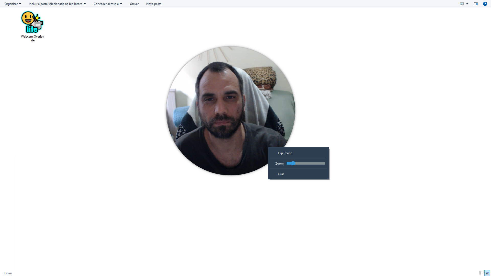

# <h1> Webcam Overlay Lite</h1>

A simple, lightweight, and customizable circular webcam overlay for your desktop. Always on top, frameless, and easy to use. Perfect for streamers, online teachers, video conferencing, and anyone who needs a clean webcam display without the clutter.



---

## 🚀 Download & Run (Recommended)

The easiest way to use the app is to download the ready-to-use executable.

1.  Go to the **[Latest Release Page](https://github.com/leoawen/webcam-overlay-lite-app/releases/latest)**.
2.  Under the "Assets" section, download the `Webcam.Overlay.lite.exe` file.
3.  Double-click the downloaded file to run it. **No installation needed!**

> **⚠️ Important Security Note**
> Windows may show a "Windows protected your PC" (SmartScreen) warning because the app is not from a registered publisher. This is expected. To run it, click **"More info"** and then **"Run anyway"**.

## ⚙️ How to Use the App

*   **Move:** Click and drag the center of the circle.
*   **Resize:** Move your cursor to the edge of the circle until it changes, then click and drag.
*   **Options:** Right-click on the circle to open the menu for **Flip**, **Zoom**, and **Quit**.

## ✨ Features

*   **Circular Mask:** Displays your webcam in a clean, circular frame.
*   **Always on Top:** Stays visible over all other windows.
*   **Frameless & Clean:** No distracting title bar or borders.
*   **Draggable & Resizable:** Full control over placement and size.
*   **Flip & Zoom:** Mirror your webcam or zoom in for a closer look via the right-click menu.
*   **Lightweight:** Minimal resource usage, runs smoothly.
*   **Portable:** No installation required, just run the `.exe`.


## 📄 License

This project is open source and available under the [MIT License](LICENSE).

---

<details>
<summary>For Developers: Running from Source Code</summary>

If you prefer to run the application from the Python source code, follow these steps.

### Requirements
You will need Python 3 and the following libraries:

*   `opencv-python`
*   `PyQt6`

### Installation

1.  **Clone the repository:**
    ```bash
    git clone https://github.com/leoawen/webcam-overlay-lite-app.git
    cd webcam-overlay-lite-app
    ```

2.  **Install the required libraries:**
    ```bash
    pip install opencv-python PyQt6
    ```

3.  **Run the application:**
    ```bash
    python webcam_circular6.py
    ```

</details>

<br>

<details>
<summary>Tradução para Português 🇧🇷</summary>

# <h1> Webcam Overlay Lite</h1>

Um overlay de webcam circular, simples, leve e customizável para o seu desktop. Sempre no topo, sem bordas e fácil de usar. Perfeito para streamers, professores online, videoconferências e qualquer pessoa que precise de uma exibição de webcam limpa.

## 🚀 Download e Execução (Recomendado)

A forma mais fácil de usar o aplicativo é baixando o executável pronto para uso.

1.  Acesse a **[Página de Releases mais recente](https://github.com/leoawen/webcam-overlay-lite-app/releases/latest)**.
2.  Na seção "Assets", baixe o arquivo `Webcam.Overlay.lite.exe`.
3.  Dê um duplo clique no arquivo baixado para executá-lo. **Nenhuma instalação é necessária!**

> **⚠️ Nota de Segurança Importante**
> O Windows pode exibir um aviso "O Windows protegeu o seu computador" (SmartScreen) porque o aplicativo não é de um desenvolvedor registrado. Isso é normal. Para executá-lo, clique em **"Mais informações"** e depois em **"Executar mesmo assim"**.

## ⚙️ Como Usar o Aplicativo

*   **Mover:** Clique no centro do círculo e arraste.
*   **Redimensionar:** Mova o cursor até a borda do círculo até ele mudar de forma, então clique e arraste.
*   **Opções:** Clique com o botão direito no círculo para abrir o menu com as opções **Rebater** (Flip), **Zoom** e **Sair** (Quit).

## ✨ Funcionalidades

*   **Máscara Circular:** Exibe sua webcam em um formato circular e limpo.
*   **Sempre no Topo:** Permanece visível sobre todas as outras janelas.
*   **Sem Bordas e Limpo:** Sem barras de título ou bordas que causam distração.
*   **Arrastável e Redimensionável:** Controle total sobre a posição e o tamanho.
*   **Rebater e Zoom:** Espelhe a imagem ou aplique zoom através do menu de contexto.
*   **Leve:** Uso mínimo de recursos do sistema, roda de forma fluida.
*   **Portátil:** Não precisa de instalação, apenas execute o `.exe`.

</details>
